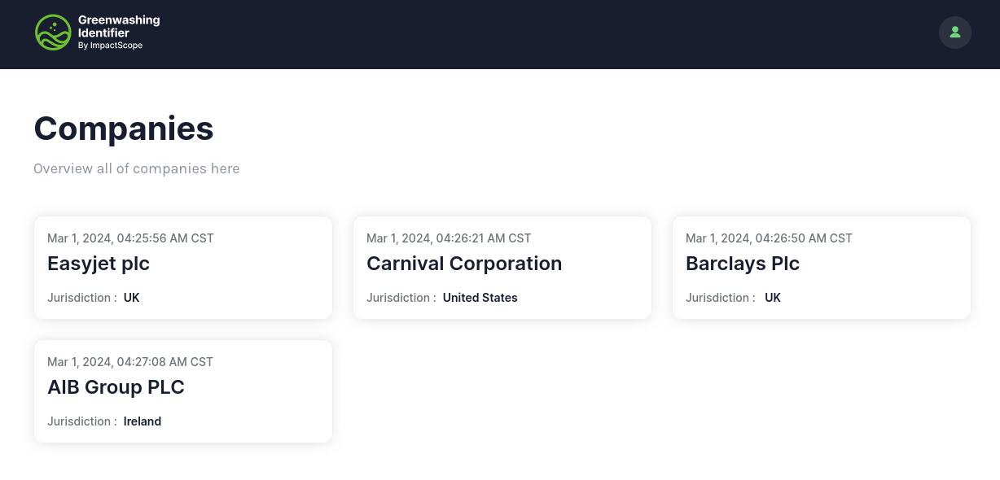
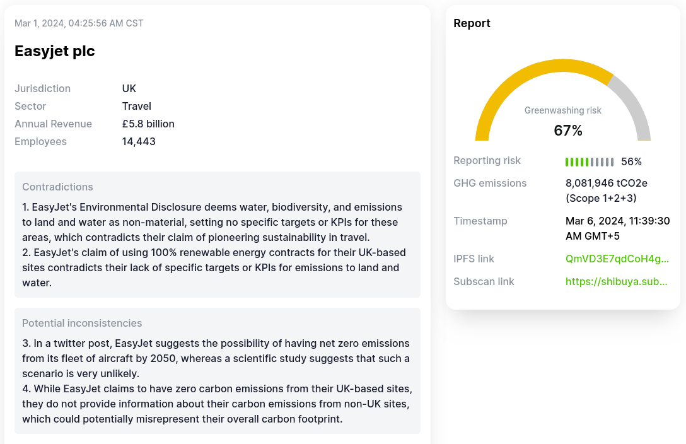
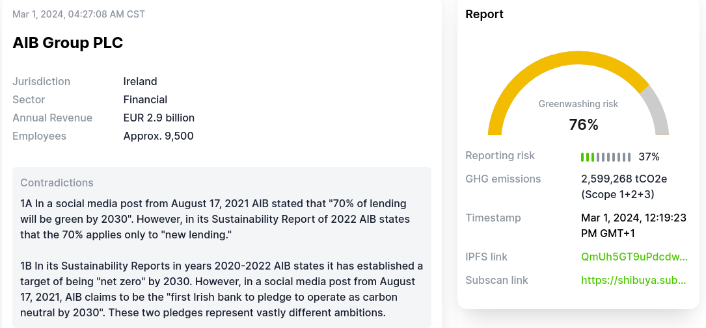

# Greenwasher Identifier

- **Team Name:** ImpactScope
- **Payment Address:** $address
- **[Level](https://github.com/w3f/Grants-Program/tree/master#level_slider-levels):** 2

### Overview

The Greenwasher Identifier (GWI) project is set to migrate its blockchain infrastructure to Substrate, enhancing its capabilities to create a more transparent, decentralized platform. This platform aims to verify and score environmental claims of organizations, aiding consumers and corporate entities in identifying greenwashing practices.

### Project Details

Utilizing blockchain and AI, GWI provides a solution for financial regulatory authorities, asset managers,  to save thousands of hours annually while ensuring compliance with evolving regulatory standards. This migration to Substrate offers improved scalability, interoperability, and smart contract functionality.

- **Objective:** Migrate GWI from its current blockchain base to Substrate, integrating new functionalities to track publicly available information changes, enhancing transparency and data integrity.
- **Relevance:** Aligns with the Web3 Foundation's mission by leveraging Substrate to promote decentralization and address contemporary social challenges.
- **Technology Stack:**
    * **Substrate for Blockchain:** Utilize Substrate for its modularity, flexibility, and rich ecosystem for blockchain development.
    * **AI for Analysis:** Continue to leverage AI for evaluating organizational environmental efforts and scoring their authenticity.
- **Core Components:** Include AI modules for analysis, Substrate-based Smart Contract (Pallet) for data integrity, and IPFS integration for data storage.
- **User Interface and Verification API:** A user-friendly interface and an API for external applications, enabling easy access to verified public information.
- **Comprehensive Reporting:** Generates detailed reports highlighting discrepancies, unsubstantiated claims, and potential inconsistencies in environmental disclosures.

### Ecosystem Fit

- **Integration into Ecosystem:** GWI takes a unique position in the ecosystem by leveraging Substrate to combat greenwashing, encouraging an environment of trust and accountability.
- **Target Audience:** Expanding to include NGOs, financial regulatory bodies, asset managers, and corporations committed to genuine sustainable practices.
- **Needs Addressed:** The demand for accurate monitoring and reporting on green practices to combat greenwashing.
- **Unique Aspect:** Unlike any existing projects within the ecosystem, GWI uniquely combines AI's analytical power with blockchain's immutability to create a comprehensive greenwashing detection system.

### Example Reports
Demo reports page with a few examples of the reports generated by the Greenwasher Identifier.

---

**EasyJet's Environmental Disclosure Analysis**

Analysis Date: Mar 1, 2024, 12:19:23 PM GMT+1

**Key Findings:**
  1. Identification of non-material treatment of water, biodiversity, and emissions contrary to claims of sustainability leadership
  2. Contradictions in renewable energy commitments vs. the absence of specific emissions reduction targets.
  3. Unlikely achievement of net zero emissions by 2050 based on existing scientific consensus.
  4. Obscured overall carbon footprint due to non-disclosure of non-UK sites emissions.
  5. General lack of substantiated data to support the effectiveness of reported sustainability initiatives.
---

**AIB Group's Environmental Disclosure Analysis**

Analysis Date: Mar 1, 2024, 04:04:27 PM GMT+5

**Key Findings:**
  1. Discrepancies in lending and "net zero" pledges indicating differing ambitions.
  2. Increased Scope 3 emissions without adequate context or justification.
  3. Inconsistencies and lack of clarity in green lending figures and GHG emissions reductions.
  4. Unsubstantiated claims about the encouragement of suppliers' carbon emissions reporting and ambiguous alignment with SDG 13 'Climate Action'.
  5. Promotions of lower-carbon business models in sectors with delayed net zero targets, raising questions about the alignment with overall net zero goals.

## Team :busts_in_silhouette:

### Team members

- Name of team leader
- Names of team members

### Contact

- **Contact Name:** Full name of the contact person in your team
- **Contact Email:** Contact email (e.g. john@duo.com)
- **Website:** Your website

### Legal Structure

- **Registered Address:** Address of your registered legal entity, if available. Please keep it in a single line. (e.g. High Street 1, London LK1 234, UK)
- **Registered Legal Entity:** Name of your registered legal entity, if available. (e.g. Duo Ltd.)

### Team's experience

ImpactScope is a sustainability focused technology company building AI and web3 tools for social enterprises, financial regulators, NGOs and digital asset ventures. We have a corporate presence in Switzerland and Estonia and team members in seven different countries. Our team is a unique blend of impact entrepreneurs, data scientists, researchers, software engineers and sustainability practitioners, including recognized global authorities in behavioral economics, tokenomics engineering, NLP and smart contract design.
[Awards and Recognition](https://www.fca.org.uk/news/news-stories/fca-reveals-gfin-greenwashing-techsprint-winners)

ImpactScope is parthering with Hashed Systems DAO LLC, a substrate development team with years of experience building blockchain applications. They have worked on substrate and Polkadot since spring 2021. Their developers completed Brian Chen's course and have experience running substrate chains and have significant experience working with the Uniques, Identity and Node-authorization pallets. Additional relevant experience below:

[Hypha DAO](https://dho.hypha.earth/#/): Smart contracts and front end development that enables the creation of flexible roles, assignments and contributions with recurring payments. Design and implement a graph data layer to improve web application performance. Design and build a [Double Entry accounting](https://us02web.zoom.us/rec/share/eRqiBvq-dsV0L_hEjW5e8DWNYQlUn2bLhI8-86jkRVwdXiN3TiD5edym17ubCd9R.QhKQw_Byy0t5_8SW?startTime=1647371674000) (Passcode: .V$C#Br2) plattform that streams wallet activity, supports token price history, reporting and currency conversion.

[SEED](https://joinseeds.earth/): Smart contract and mobile development that capture the project's constitution, enable voting on proposals and basic identity management like reputation, vote history etc. Design and build a PWA token swaps app. Design and build a basic [Economic Simulator](https://seeds-sim.hypha.earth/dashboard) that enables voters to understand the economic impact of policy changes.

### Team Code Repos

- https://github.com/{your_organisation}/{project_1}
- https://github.com/{your_organisation}/{project_2}

Please also provide the GitHub accounts of all team members. If they contain no activity, references to projects hosted elsewhere or live are also fine.

- https://github.com/{team_member_1}
- https://github.com/{team_member_2}

### Team LinkedIn Profiles (if available)

- https://www.linkedin.com/{person_1}
- https://www.linkedin.com/{person_2}

## Development Status :open_book:

The transition of GWI to the Substrate platform marks a new phase, moving beyond initial AI integration. The focus is now on enhancing transparency, accountability, and operational efficiency through the Substrate's inherent capabilities.

## Development Roadmap :nut_and_bolt:

### Overview

- **Total Estimated Duration:** 14 weeks
- **Full-Time Equivalent (FTE):** 3 FTE (across 7 developers)
- **Total Costs:** 24,300 USD

### Milestone 1 — Preliminary Migration and Functional Integration

- **Estimated Duration:** 3 weeks
- **FTE:** 3.5 FTE (across 7 developers)
- **Costs:** 6,700 USD

| Number | Deliverable             | Specification |
| ------:|-------------------------|---------------|
| 0a. | License | MIT |
| 0b. | Documentation | We will provide **inline documentation** of the code and a basic **tutorial** of the modules delivered in this Milestone.|
| 0c. | Testing | Unit testing will be applied to ensure reliability. Documentation of tests and results will be provided |
| 0d. | Video | We will provide a video demonstration that will illustrate all of the functionality delivered with this milestone. |
| 0e. | Article | We will publish an **article** in English and Spanish that explains what was built and how it can benefit other projects |
| 1. | Project Setup | Setup project repository, selecting Substrate version and configuring the initial environmental setup for development. |
| 2. | Migration Plan | Document detailing the strategy for migrating GWI functionalities to Substrate, including smart contracts revision to suit Substrate's paradigm. |
| 3. | Architecture Design | A comprehensive document describing the new system architecture on Substrate, including module interactions, data flow diagrams, and storage solutions. |

### Milestone 2 — Enhanced Data Verification and Transparency

- **Estimated Duration:** 4 weeks
- **FTE:** 3.5 FTE (across 7 developers)
- **Costs:** 8,000 USD
  
| Number | Deliverable             | Specification |
| ------:|-------------------------|---------------|
| 0a. | License | MIT |
| 0b. | Documentation | We will provide **inline documentation** of the code and a basic **tutorial** of the modules delivered in this Milestone.|
| 0c. | Testing | Unit testing will be applied to ensure reliability. Documentation of tests and results will be provided |
| 0d. | Video | We will provide a video demonstration that will illustrate all of the functionality delivered with this milestone. |
| 0e. | Article | We will publish an **article** in English and Spanish that explains what was built and how it can benefit other projects |
| 1. | Data Ingestion Module | Development of a module for ingesting public data from multiple sources with hashing functionality to generate unique identifiers for each data piece. |
| 2. | Blockchain Integration | Implementing smart contracts on Substrate for storing data hashes, ensuring data integrity, and enforcing immutability. |
| 3. | Data Storage Solution | Integration with IPFS for storing original data, retrieving information through unique hashes stored on the blockchain. |
| 4. | Verification Mechanism | Development of an on-chain verification mechanism allowing users to verify the integrity and authenticity of public information. |
| 5. | Docker Container | We will provide a Docker container that encapsulates the entire software stack for easy deployment by end-users.  |

### Milestone 3 — Interface Development, Testing, and Deployment

- **Estimated Duration:** 5 weeks
- **FTE:** 3.5 FTE (across 7 developers)
- **Costs:** 7,200 USD

| Number | Deliverable             | Specification |
| ------:|-------------------------|---------------|
| 0a. | License | MIT |
| 0b. | Documentation | We will provide **inline documentation** of the code and a basic **tutorial** of the modules delivered in this Milestone.|
| 0c. | Testing | Unit testing will be applied to ensure reliability. Documentation of tests and results will be provided |
| 0d. | Video | We will provide a video demonstration that will illustrate all of the functionality delivered with this milestone. |
| 0e. | Article | We will publish an **article** in English and Spanish that explains what was built and how it can benefit other projects |
| 1. | User Interface | Development of a user-friendly interface for interacting with the GWI, including functionalities for data submission, verification, and reporting. |
| 2. | API Development | Creation of an API to enable third-party services to access verified information and incorporate GWI functionalities into their platforms. |
| 3. | System Testing | Comprehensive testing covering all developed functionalities to ensure reliability and performance on the Substrate framework. |
| 4. | Deployment Guidelines | Documentation providing guidelines for deploying GWI on Substrate, including system configuration, node setup, and smart contract deployment. |

### Milestone 4 — Outreach, Partnerships, and Education

- **Estimated Duration:** 2 weeks
- **FTE:** 3.5 FTE (across 7 developers)
- **Costs:** 3,500 USD

| Number | Deliverable             | Specification |
| ------:|-------------------------|---------------|
| 0a. | License | MIT |
| 0b. | Documentation | We will provide **inline documentation** of the code and a basic **tutorial** of the modules delivered in this Milestone.|
| 0c. | Testing | Unit testing will be applied to ensure reliability. Documentation of tests and results will be provided |
| 0d. | Video | We will provide a video demonstration that will illustrate all of the functionality delivered with this milestone. |
| 0e. | Article | We will publish an **article** in English and Spanish that explains what was built and how it can benefit other projects |
| 1. | Outreach Plan | Implementation of an outreach plan targeting stakeholders within the Polkadot ecosystem to promote GWI and encourage adoption. |
| 2. | Partnership Development | Initiating dialogues with potential partners for collaboration and integration opportunities to enhance the project's reach and impact. |
| 3. | Educational Content | Creation of educational materials (articles, webinars, workshops) to demonstrate the value of GWI and educate on using blockchain for sustainability. |

## Future Plans

The migration of GWI to the Substrate framework and the Polkadot ecosystem opens up new avenues for growth and impact. Emphasis will be on expanding the technological capabilities, refining AI models, and forging more partnerships to leverage blockchain for sustainability and transparency.
